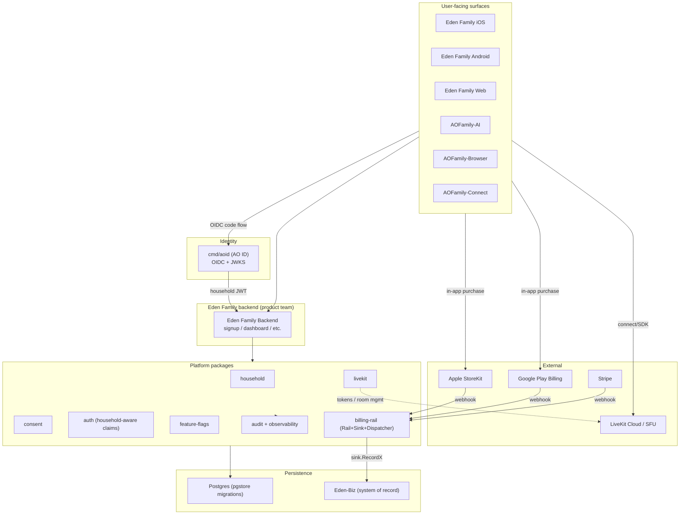

# Eden Family Platform Integration — Architecture

**Status:** Reference / launch-readiness
**Milestone:** M9 (objective 33) — closed
**Verification:** `platform/integration/eden_family_test.go`

This document describes how the platform packages compose into the Eden
Family launch surface. It is the architectural counterpart to the
`platform/integration` test suite — the test proves the runtime contract;
this doc explains the topology to humans.

## 1. Executive summary

Post-M9, Eden Family launches on the shared `eden-platform-go` stack
without per-product duplication of family, consent, identity, billing, or
calling concerns. Six platform packages (plus audit and observability)
compose the runtime; one identity service (`cmd/aoid`) issues
household-aware JWTs; one financial system of record (Eden-Biz, per
decision D1) absorbs billing-rail events. The integration is verified by
the test suite in `platform/integration/`.

## 2. Topology

```
                       ┌──────────────────────────────────┐
                       │     User-Facing Surfaces         │
                       │  Eden Family iOS / Android / Web │
                       │  AOFamily-AI / Browser / Connect │
                       └──────────────┬───────────────────┘
                                      │
                  ┌───────────────────┼─────────────────────┐
                  │                   │                     │
                  ▼                   ▼                     ▼
            ┌──────────┐       ┌───────────┐         ┌────────────┐
            │  AO ID   │       │  Eden     │         │  Mobile    │
            │ (cmd/aoid)│      │  Family   │         │ App Stores │
            │ OIDC/JWKS │◀────│  Backend  │────────▶│ IAP / Play │
            └────┬─────┘       │ (product) │         └─────┬──────┘
                 │             └─────┬─────┘               │
                 │ household JWT     │                     │ webhooks
                 │ (HouseholdID/     │                     │
                 │  ChildID/         │                     ▼
                 │  ChildMode)       │              ┌─────────────┐
                 │                   │              │  billing-   │
                 ▼                   ▼              │  rail       │
            ┌──────────────────────────────┐       │ (Rail+Sink) │
            │     PLATFORM PACKAGES         │      │  Dispatcher │
            │ household / consent / auth /  │◀─────┤             │
            │ feature-flags / livekit /     │      └──────┬──────┘
            │ audit / observability         │             │
            └──────────────┬────────────────┘             │
                           │                              │
                           ▼                              ▼
                   ┌───────────────┐              ┌────────────┐
                   │   Postgres    │              │  Eden-Biz  │
                   │ (pgstore mig) │              │  (system   │
                   └───────────────┘              │  of record)│
                                                  └────────────┘
```

### Mermaid (rendered)



## 3. Boundary table

For every platform package: what it owns, what Eden Family must not
duplicate, where to find the integration evidence.

| Package | Owns | Eden Family must NOT duplicate | Test |
|---|---|---|---|
| `platform/household` | Households, members, parent-of-record links, role + capability model | Per-product family tables; per-product POR logic | `TestEdenFamily_SignupFlow`, `TestEdenFamily_NegativeChildAccountRequiresEligibleParent` |
| `platform/consent` | Append-only consent ledger (COPPA / GDPR-K), grant/revoke, validity-as-of-T queries, read-side audit | Per-product consent tables; ad-hoc "consented?" booleans | `TestEdenFamily_ChildAccountWithConsent`, `TestEdenFamily_ConsentRevocationGatesAI` |
| `platform/auth` (household claims) | `HouseholdID` / `ChildID` / `ChildMode` JWT claims; `CreateHouseholdAccessToken`; `RequireHousehold` / `RequireParentMode` / `RequireChildMode` middleware | Per-product JWT shapes; ad-hoc parent-mode booleans in cookies | `TestEdenFamily_ParentChildJWTSession`, `TestEdenFamily_NegativeChildCannotActAsParent` |
| `platform/feature-flags` | Boolean + variant flags, percent rollouts, overrides on subject/household/tenant/environment axes | Per-product flag tables; hard-coded if/else on tier strings | `TestEdenFamily_FeatureFlagGate` |
| `platform/billing-rail` | `Rail` adapter contract; `EdenBizSink` consumer contract; `Dispatcher` HTTP webhook wiring; mock rail + sink for tests | Per-product Stripe / Apple / Google clients; per-product billing event tables | `TestEdenFamily_BillingRailSubscription`, `TestEdenFamily_BillingRailChargeAndRefund` |
| `platform/livekit` | 1:1 call + multi-party meeting lifecycle; room name mapping; webhook intake; recording; signaling | Per-product call state machines; per-product LiveKit clients | `TestEdenFamily_OneToOneVideoCall` |
| `platform/audit` | Append-only audit log with company-scoped events; async batch fan-out | Per-product audit tables; bespoke logging for compliance | `TestEdenFamily_AuditTrailEndToEnd` |
| `platform/observability` | Sentry + slog wrappers, structured logging context | Per-product `sentryutil` packages | (verified at unit level in Obj 16) |
| `cmd/aoid` (AO ID service) | Standalone OIDC issuer that signs household JWTs; JWKS endpoint; federation surface (Obj 31) | Per-product login UIs; per-product token signing | Obj 30 E2E test (`internal/aoid`) |

## 4. Wire formats

### 4.1 Household-aware JWT (access token)

Signed with ML-DSA-65 (post-quantum) by the JWT manager.

```json
{
  "iss": "ao-id",
  "sub": "11111111-1111-1111-1111-111111111111",
  "exp": 1730000000,
  "iat": 1729999100,
  "jti": "ab12cd34ef56...",
  "uid": "11111111-1111-1111-1111-111111111111",
  "hid": "22222222-2222-2222-2222-222222222222",
  "child_id": "33333333-3333-3333-3333-333333333333",
  "child_mode": true
}
```

B2B tokens (AODex / eden-biz) omit `hid` / `child_id` / `child_mode`
entirely — the `omitempty` tag preserves backward-compat wire format.

### 4.2 Consent ledger entry (Eden Family signup → AI tutor)

```json
{
  "id": "44444444-4444-4444-4444-444444444444",
  "household_id": "22222222-2222-2222-2222-222222222222",
  "principal_member_id": "55555555-5555-5555-5555-555555555555",
  "consenter_member_id": "66666666-6666-6666-6666-666666666666",
  "purpose": "ai_tutor_interaction",
  "consent_text_version": "eden-family-tos-v1",
  "evidence": {
    "method": "click_through",
    "recorded_at": "2026-05-10T18:30:00Z",
    "ip_address": "203.0.113.5",
    "reference": "eden-family-onboarding-v1"
  },
  "revokes_id": null,
  "granted_at": "2026-05-10T18:30:00Z"
}
```

Revocation = a new ledger row with `revokes_id` pointing at the original.
Existing rows are never mutated (enforced by row-level triggers in
`platform/pgstore`).

### 4.3 Billing-rail webhook (canonical event after rail-native mapping)

```json
{
  "rail_event_id": "evt_test_001",
  "rail_name": "stripe",
  "type": "subscription.created",
  "occurred_at": "2026-05-10T18:35:12Z",
  "customer": {
    "id": "22222222-2222-2222-2222-222222222222",
    "tenant_id": "00000000-0000-0000-0000-000000000000",
    "metadata": {"household_id": "22222222-..."}
  },
  "subscription_id": "sub_test_001",
  "rail_object": { /* rail-native body, verbatim */ }
}
```

### 4.4 LiveKit join token

Issued by `platform/livekit.Tokens.IssueJoinToken`. The token is opaque to
the platform; the adapter knows the room name + identity + TTL + grant
shape.

## 5. Failure modes

| Failure | Behaviour | Test |
|---|---|---|
| Household DB down (pgstore `ErrConnPool`) | Caller surfaces `wrap(household.Store err)` to handler; 503 with retry-after appropriate | per-package `pgstore` tests |
| Consent ledger unavailable | `Consent.IsValid` returns wrapped error; handlers MUST fail-closed (deny child action) — never assume valid | TRD 33-01 negative pathway |
| Feature-flag source unavailable | `Client.IsEnabled` returns false (closed) per package contract | `featureflags.ErrSourceUnavailable` documented |
| Billing-rail webhook bad signature | `Dispatcher.Handle` returns `ErrInvalidSignature`; sink is NOT called; caller returns 400 | `TestEdenFamily_BillingRailChargeAndRefund` |
| Billing-rail unsupported event | `Dispatcher.Handle` returns `ErrUnsupportedEvent` joined with type; caller returns 204 | dispatcher contract |
| LiveKit room creation fails | Call transitions to `StateFailed` with `end_reason="room_creation_failed"`; room is cleaned up | `platform/livekit/service.go` `AcceptCall` |
| JWT validation fails (kid unknown, sig invalid) | `JWTManager.ValidateAccessToken` returns wrapped jwt error; handler returns 401 | `platform/auth/jwt_test.go` |
| Audit logger backpressure | `Logger.Log` drops with slog.Warn — never blocks the request path | `platform/audit/logger.go` |

## 6. Reference

- Integration test: `platform/integration/eden_family_test.go`
- Launch checklist: `docs/eden-family-launch-checklist.md`
- TRDs: `.planning/objectives/33-aofamily-eden-family-integration/`
- Per-package READMEs:
  - `platform/household/README.md`
  - `platform/consent/README.md`
  - `platform/auth/README.md`
  - `platform/feature-flags/README.md`
  - `platform/billing-rail/README.md`
  - `platform/livekit/README.md`
- Standardization plan: `PORTFOLIO_STANDARDIZATION_PLAN.md` §11 M9
